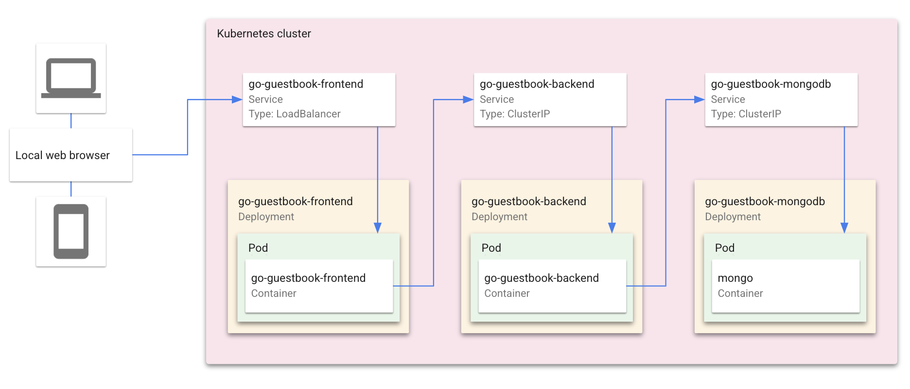

# 使用 Cloud Code 的留言板

Guestbook 示例演示了如何使用 [Cloud Code for IntelliJ 扩展](https://cloud.google.com/code/docs/intellij/install?utm_source=ext&utm_medium=partner&utm_campaign=CDR_kri_gcp_cloudcodereadmes_012521&utm_content=-) 部署包含前端服务和后端服务的 Kubernetes 应用程序。当您运行该应用程序时，Cloud Code 会在后台使用 [skaffold](https://skaffold.dev/docs/) 来构建镜像并部署项目的 Kubernetes 清单。要了解有关 Kubernetes 的更多信息，请浏览 [Kubernetes 概述](https://kubernetes.io/docs/concepts/overview/)。

### 目录
* [此示例中包含的内容](#whats-in-this-sample)
  * [Kubernetes 架构](#kubernetes-architecture)
  * [目录内容](#directory-contents)
  * [Skaffold 模块](#skaffold-modules)
* [入门](#getting-started)
    1. [使用 minikube 在本地运行应用程序](#run-the-app-locally-with-minikube)
        * [编辑运行配置](#edit-run-configuration)
        * [在 minikube 上运行应用程序](#run-the-app-on-minikube)
    2. [使用 Google Kubernetes Engine 远程运行应用程序](#run-the-app-remotely-with-google-kubernetes-engine)
        * [设置 GKE 集群](#set-up-a-gke-cluster)
        * [将应用程序部署到 GKE](#deploy-app-to-gke)
    3. [使用 Skaffold 模块运行单个服务](#run-individual-services-with-skaffold-modules)
* [后续步骤](#next-steps)
* [注册用户研究](#sign-up-for-user-research)
* [获取支持](#getting-support)

---
<h2 id="whats-in-this-sample"> 此示例中包含的内容 </h2>

<h3 id="kubernetes-architecture"> Kubernetes 架构 </h3>

<h3 id="directory-contents"> 目录内容 </h3>

- `skaffold.yaml` - 一个 schema 文件，作为应用程序中所有 Skaffold 模块的入口点
- `src/frontend/` - 留言板前端服务，包含以下配置文件：
  - `skaffold.yaml` - 定义前端 Skaffold 模块的 schema 文件 ([skaffold.yaml 参考](https://skaffold.dev/docs/references/yaml/))
  - `kubernetes-manifests/guestbook-frontend.deployment.yaml` - 部署一个包含前端容器镜像的 pod
  - `kubernetes-manifests/guestbook-frontend.service.yaml` - 创建一个负载均衡器并在集群中的外部 IP 上公开前端服务

- `src/backend/` - 留言板后端服务，包含以下配置文件：
  - `skaffold.yaml` - 定义后端 Skaffold 模块的 schema 文件 ([skaffold.yaml 参考](https://skaffold.dev/docs/references/yaml/))
  - `kubernetes-manifests/guestbook-backend.deployment.yaml` - 部署一个包含后端容器镜像的 pod
  - `kubernetes-manifests/guestbook-backend.service.yaml` - 在集群中的内部 IP 上公开后端服务
  - `kubernetes-manifests/guestbook-mongodb.deployment.yaml` - 部署一个包含 MongoDB 实例的 pod
  - `kubernetes-manifests/guestbook-mongodb.service.yaml` - 在集群中的内部 IP 上公开 MongoDB 服务

<h3 id="skaffold-modules"> Skaffold 模块 </h3>

  Guestbook 应用程序使用 Skaffold 配置依赖项或 **模块** 来为前端和后端服务定义单独的配置。每个模块构成一个单一的构建-测试-部署管道，可以单独执行，也可以作为另一个模块的依赖项执行。

  Cloud Code 支持在单个模块或多个模块的子集上进行迭代开发和调试，并使编辑带有模块的 skaffold.yaml 文件配置变得更加容易。底层的 Skaffold 负责处理模块依赖关系及其部署顺序。

  默认情况下，Guestbook 会同时运行前端和后端模块。要运行单个模块，请按照 [使用 Skaffold 模块运行单个服务](#run-individual-services-with-skaffold-modules) 部分中的步骤操作。

---
<h2 id="getting-started"> 入门 </h2>

<h3 id="run-the-app-locally-with-minikube"> 使用 minikube 在本地运行应用程序 </h3>

<h4 id="edit-run-configuration"> 编辑运行配置 </h4>

1. 单击顶部任务栏中的配置下拉列表，然后单击 **Edit Configurations**。
   

   **Develop on Kubernetes** 配置会监视更改，然后使用 [skaffold](https://skaffold.dev/docs/) 重新构建并重新运行您的应用程序。您可以通过更改此运行配置或创建新的 Cloud Code: Kubernetes 运行配置来自定义部署。

3. 在 **Run > Deployment** 下，选择“Deploy locally to a minikube cluster”。
   

4. 单击 **OK** 保存您的配置。

<h4 id="run-the-app-on-minikube"> 在 minikube 上运行应用程序 </h4>

1. 从配置下拉列表中选择 **Develop on Kubernetes**，然后单击运行图标。Cloud Code 会在本地 [minikube](https://minikube.sigs.k8s.io/docs/start/) 集群中运行您的应用程序。

2. 在输出窗口中查看构建过程。部署成功后，您会收到新服务 URL 可用的通知。单击“Service URLs”选项卡以查看 URL，然后单击 URL 链接以在浏览器中打开正在运行的应用程序。
   

3. 要停止应用程序，请单击配置下拉列表旁边的停止图标。

---
<h3 id="run-the-app-remotely-with-google-kubernetes-engine"> 使用 Google Kubernetes Engine 远程运行应用程序 </h3>

<h4 id="set-up-a-gke-cluster"> 设置 GKE 集群 </h4>

1. 从右侧面板导航到 Kubernetes Explorer，或转到 **Tools > Cloud Code > Kubernetes > View Cluster Explorer**。

2. 单击 **+** 创建新集群，或转到 **Tools > Cloud Code > Kubernetes > Add GKE Cluster**。

3. 如果出现提示，请登录您的 GCP 帐户并选择一个项目。

4. 单击 **Create a new GKE cluster**。您将被重定向到 Google Cloud Console 以创建新集群。

5. 创建 GKE 集群后，它将显示在 Cluster Explorer 中。

6. 默认情况下，您的新集群将设置为当前上下文。要切换上下文，请在 Cluster Explorer 中右键单击其他集群，然后选择 **Set as Current Context**。

<h4 id="deploy-app-to-gke"> 将应用程序部署到 GKE </h4>

1. 从配置下拉列表中选择 **Develop on Kubernetes**，然后单击运行图标。

2. 在输出窗口中查看构建过程。部署成功后，您会收到新服务 URL 可用的通知。单击“Service URLs”选项卡以查看 URL，然后单击 URL 链接以在浏览器中打开正在运行的应用程序。

3. 要停止应用程序，请单击配置下拉列表旁边的停止图标。

---
<h3 id="run-individual-services-with-skaffold-modules"> 使用 Skaffold 模块运行单个服务 </h3>

1. 转到 **Run** > **Edit configurations** 并打开 **Build / Deploy** 选项卡。

2. 选择 skaffold.yaml。

3. 选择 **Build and deploy with** 并选择前端或后端模块。这会告诉 Cloud Code 仅部署所选服务。您可以选择部署多个模块。

注意：完整的 Guestbook 应用程序需要同时部署前端和后端服务才能正常运行，但在本教程中，我们将部署一个服务来演示如何运行单个模块。

4. 您现在可以通过将其部署到 [minikube](#run-the-app-on-minikube) 或 [GKE](#deploy-app-to-gke) 来运行所选模块。

您可以通过查看前端的 [skaffold.yaml](src_example/frontend/skaffold.yaml) 和后端的 [skaffold.yaml](src_example/backend/skaffold.yaml) 来了解 Guestbook 模块是如何定义的。

有关如何使用 Skaffold 模块的更多信息，请参阅 [Skaffold 文档](https://skaffold.dev/docs/design/config/#multiple-configuration-support)。

---
<h2 id="next-steps"> 后续步骤 </h2>

* 尝试使用 Cloud Code [调试您的应用程序](https://cloud.google.com/code/docs/intellij/kubernetes-debugging?utm_source=ext&utm_medium=partner&utm_campaign=CDR_kri_gcp_cloudcodereadmes_012521&utm_content=-)
* 导航 [Kubernetes Engine Explorer](https://cloud.google.com/code/docs/intellij/using-the-kubernetes-explorer?utm_source=ext&utm_medium=partner&utm_campaign=CDR_kri_gcp_cloudcodereadmes_012521&utm_content=-)
* 了解如何 [编辑 YAML 文件](https://cloud.google.com/code/docs/intellij/yaml-editing?utm_source=ext&utm_medium=partner&utm_campaign=CDR_kri_gcp_cloudcodereadmes_012521&utm_content=-) 以部署您的 Kubernetes 应用程序
* [配置现有应用程序](https://cloud.google.com/code/docs/intellij/using-a-k8-existing-app?utm_source=ext&utm_medium=partner&utm_campaign=CDR_kri_gcp_cloudcodereadmes_012521&utm_content=-) 以在 Cloud Code 上运行
* 启用 [Cloud API 和客户端库](https://cloud.google.com/code/docs/intellij/client-libraries?utm_source=ext&utm_medium=partner&utm_campaign=CDR_kri_gcp_cloudcodereadmes_012521&utm_content=-)
* 使用 [Secret Manager](https://cloud.google.com/code/docs/intellij/secret-manager?utm_source=ext&utm_medium=partner&utm_campaign=CDR_kri_gcp_cloudcodereadmes_012521&utm_content=-) 管理密钥

有关更多 Cloud Code 教程和资源，请查看 [Awesome Cloud Code](https://github.com/russwolf/awesome-cloudclode)！

---
<h2 id="sign-up-for-user-research"> 注册用户研究 </h2>

我们希望听到您的反馈！

Cloud Code 团队邀请我们的用户社区注册参加 Google 用户体验研究。

如果您受邀参加研究，您可以试用新产品或告诉我们您对日常使用的产品的看法。目前，Google 仅发送即将进行的远程研究的邀请。研究完成后，您将收到一份感谢您参与的礼物，例如礼品卡或一些 Google 纪念品。

[使用此链接注册](https://google.qualtrics.com/jfe/form/SV_4Me7SiMewdvVYhL?reserved=1&utm_source=In-product&Q_Language=en&utm_medium=own_prd&utm_campaign=Q1&productTag=clou&campaignDate=January2021&referral_code=UXbT481079) 并回答一些关于您自己的问题，这将有助于我们的研究团队将您与非常适合的研究相匹配。

----

<h2 id="getting-support"> 获取支持 </h2>

如果您遇到任何错误、令人困惑的命令或不清楚的文档，您可以 [直接在 GitHub 上](https://github.com/GoogleCloudPlatform/cloud-code-intellij/issues) 提交您的反馈。

如果您想提出功能建议或与 Cloud Code 团队和社区就您的问题进行开放式讨论，您可以在 [Cloud Code GitHub 讨论论坛](https://github.com/GoogleCloudPlatform/cloud-code-intellij/discussions) 上发帖。

在 [Stack Overflow](http://stackoverflow.com/questions/tagged/cloud-code-intellij) 上提出有关 Cloud Code 的问题。使用 `google-cloud-intellij` 标签来提问有关 Cloud Code 的问题。该标签不仅会收到来自 Stack Overflow 社区的回复，还会收到来自 Google 工程师的回复，他们会监控该标签并提供非官方支持。
